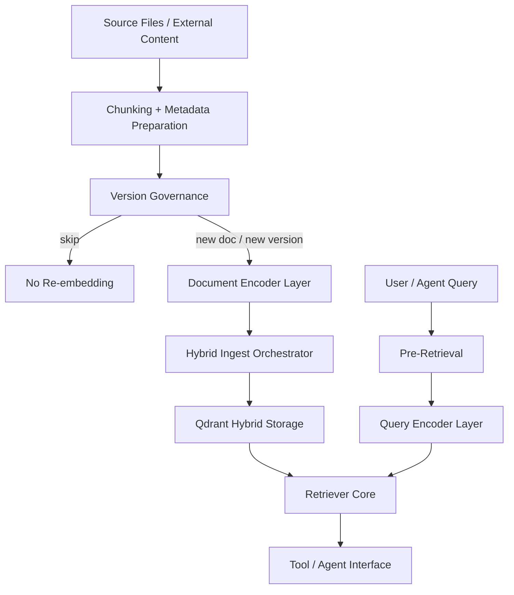
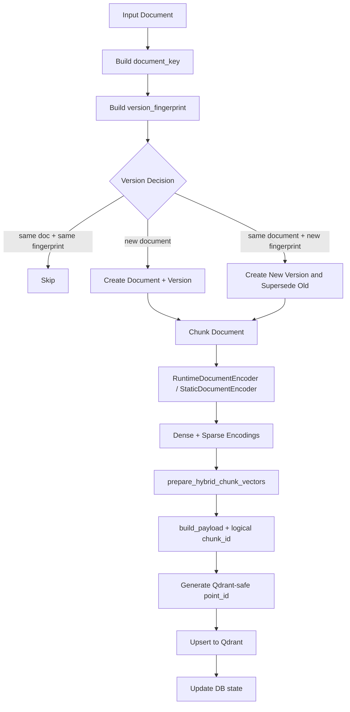
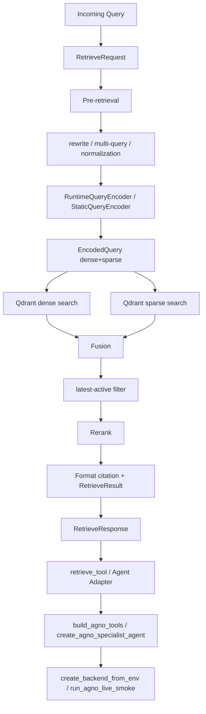
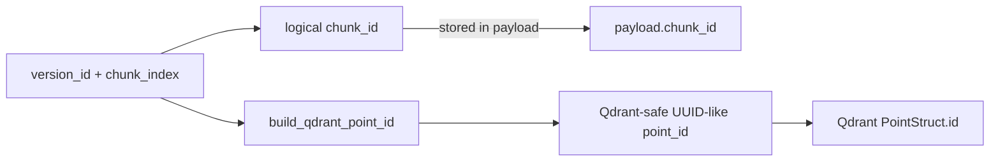
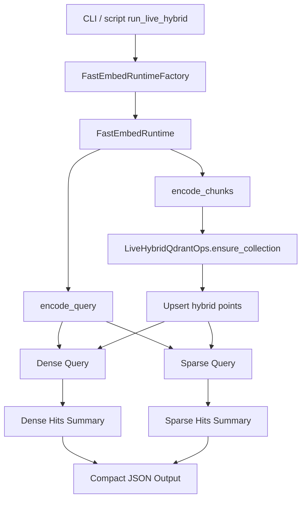
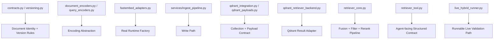
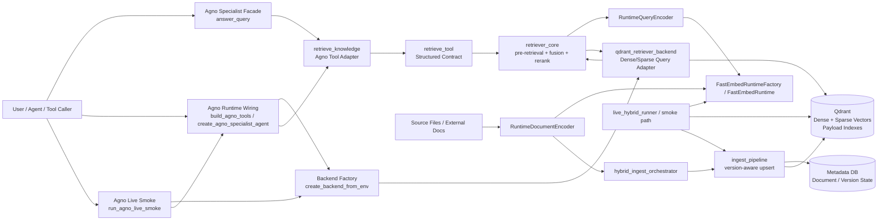

# System Flow (Mermaid)

## 1. High-Level Architecture

## 2. Ingestion Flow

## 3. Retrieval Flow

## 4. ID Strategy

## 5. Live Smoke / Runtime Validation Flow

## 6. Module Responsibility Map

## 7. Deployment / Runtime Topology

### Topology Explanation
- **User / Agent / Tool Caller**：最上層呼叫端，可能是 agent、CLI、或其他 service。
- **answer_query / Agno Specialist Facade**：Agno-oriented specialist entrypoint，負責把 retrieval 結果組裝成 citation-aware answer。
- **build_agno_tools / create_agno_specialist_agent**：Agno runtime wiring layer，提供 tool registration 與 lazy-import Agent 建立點。
- **create_backend_from_env**：從環境變數讀取最小 live wiring，建立 runtime-backed retriever backend。
- **run_agno_live_smoke**：把 backend factory、agent factory、query 執行串成最小可測 runnable path。
- **retrieve_knowledge**：Agno tool adapter，負責把 agent 請求轉成 retriever tool 呼叫。
- **retrieve_tool**：對外穩定入口，維持固定 request / response schema。
- **retriever_core**：負責 query rewrite、fusion、filter、rerank 與結果格式化。
- **RuntimeQueryEncoder / RuntimeDocumentEncoder**：把真實 runtime 包成統一介面。
- **FastEmbedRuntime**：提供 dense / sparse 真實編碼能力。
- **qdrant_retriever_backend**：把 Qdrant live query 結果轉成 retriever candidate。
- **ingest_pipeline**：負責版本判斷、payload 建立、Qdrant upsert。
- **Metadata DB**：保存 document 與 version 狀態。
- **Qdrant**：保存 dense+sparse 向量與 payload，支援 live retrieval。
- **live_hybrid_runner / smoke path**：獨立的真實環境驗證路徑，用於快速檢查整條 live path 是否正常。
